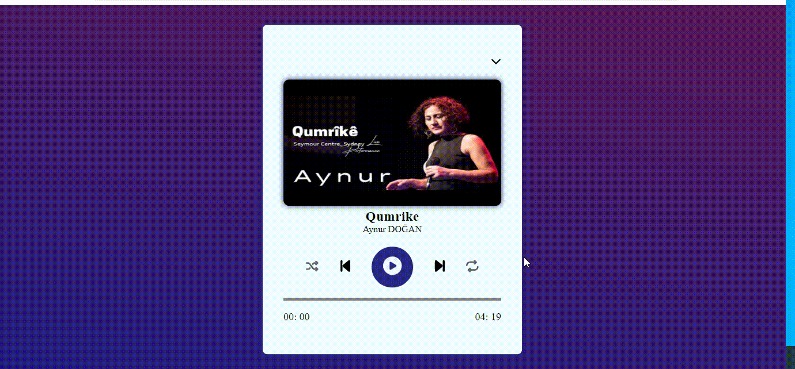

# MediaPlayer

<h1>Music Player Web App</h1>

This web application is a sleek and user-friendly music player that allows you to create playlists, control playback, and enjoy your favorite tracks effortlessly.

<h3>Features</h3>
<ul>Create and manage playlists</ul>
<ul> Standard playback controls (play, pause, next, previous) </ul>
<ul>Progress bar and time display</ul>
<ul>Repeat and shuffle modes</ul>
<ul>Responsive design for all devices</ul>

<h2>Technologies Used</h2>
<ul>HTML5</ul>
<ul>CSS3</ul>
<ul>JavaScript</ul>

<h2>How to Use</h2>
Clone the repository to your local machine.
Open index.html in your web browser.
Add songs to your playlist and start listening!
Contributions

Contributions are welcome! Submit bug reports or suggest improvements by opening an issue or PR.

